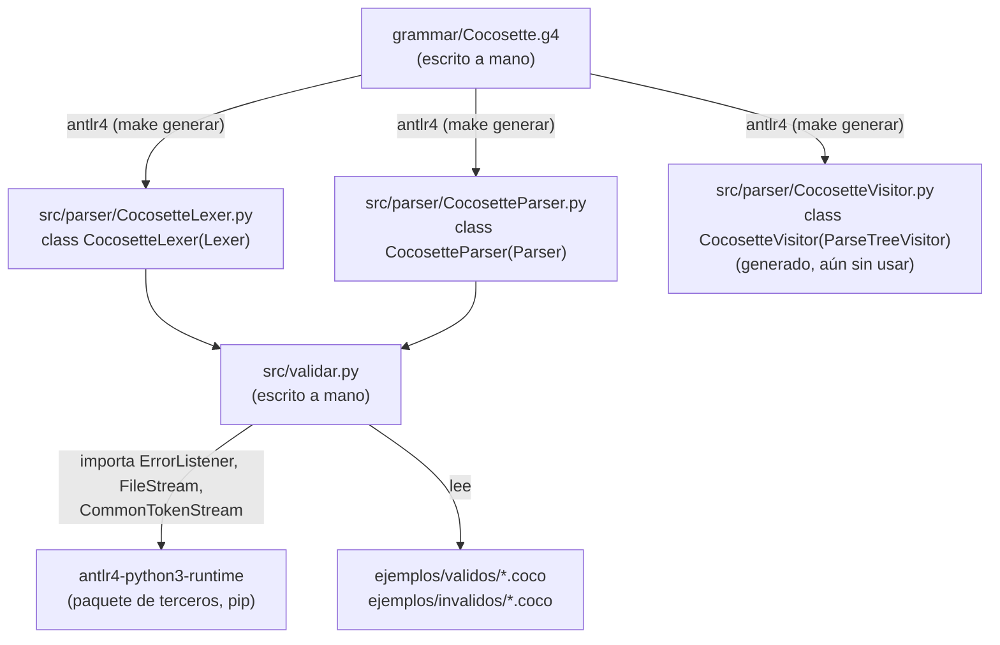

# Conceptos clave de ANTLR usados en este proyecto

Esta guía no es un entregable evaluado del Corte 1: es material de
apoyo para repasar, mientras se revisa el código, los fundamentos de
ANTLR que este proyecto usa (herencia entre clases, qué archivo genera
o importa a cuál). El documento de alcance (`documento_alcance.md`)
sigue siendo la referencia formal del diseño del lenguaje.

## 1. Lexer vs. parser, en una frase

- El **lexer** lee el archivo `.coco` **caracter a caracter** y agrupa
  esos caracteres en **tokens** (p. ej. los caracteres `c`,`a`,`r`,...
  se agrupan en un token `COCOCARGAR`). No sabe nada de la estructura
  del programa, solo de qué "palabras" existen.
- El **parser** lee la **secuencia de tokens** que produjo el lexer (ya
  no caracteres) y verifica que esa secuencia respete la gramática,
  construyendo un **árbol de análisis sintáctico** (parse tree).

En `grammar/Cocosette.g4` esto se ve en la convención de mayúsculas:
las reglas en MAYÚSCULA (`COCOCARGAR`, `ID`, `STRING`, ...) son reglas
de **lexer**; las reglas en minúscula (`programa`, `sentencia`,
`expresion`, ...) son reglas de **parser**.

## 2. Qué genera el comando `antlr4` y de qué hereda cada cosa

Al ejecutar `make generar` (que internamente corre
`antlr4 -Dlanguage=Python3 -visitor -o ../src/parser Cocosette.g4`
desde dentro de `grammar/`), ANTLR **lee el `.g4` y escribe código
Python nuevo** en `src/parser/`. Nada de este código se versiona en
git (ver `.gitignore`): es 100% reproducible a partir de la gramática.

| Archivo generado (en `src/parser/`) | Clase Python          | Hereda de           | ¿De dónde viene la clase base? |
|---|---|---|---|
| `CocosetteLexer.py`    | `CocosetteLexer`    | `Lexer`             | `antlr4` (paquete `antlr4-python3-runtime`) |
| `CocosetteParser.py`   | `CocosetteParser`   | `Parser`            | `antlr4` (paquete `antlr4-python3-runtime`) |
| `CocosetteVisitor.py`  | `CocosetteVisitor`  | `ParseTreeVisitor`  | `antlr4` (paquete `antlr4-python3-runtime`) |
| `CocosetteListener.py` | `CocosetteListener` | `ParseTreeListener` | `antlr4` (paquete `antlr4-python3-runtime`) |

La idea central: **`Lexer` y `Parser` (las clases base) contienen el
algoritmo genérico** de reconocimiento (simulación de autómatas sobre
una tabla de estados). **`CocosetteLexer` y `CocosetteParser` no
reimplementan ese algoritmo**; solo le "inyectan" la tabla concreta de
reglas de nuestro `.g4` (qué texto forma un `COCOCARGAR`, qué
secuencia de tokens forma un `programa`, etc.). Por eso una gramática
de 300 líneas puede convertirse en cientos de líneas de Python
generado sin que nosotros hayamos escrito ese algoritmo: lo hereda del
runtime.

En este corte solo usamos `CocosetteLexer` y `CocosetteParser`
(`CocosetteVisitor.py` se generó porque pasamos `-visitor`, pero no
se usa todavía; se implementará como base del intérprete en el
Corte 2 — ver la nota sobre alternativas etiquetadas en el `.g4`).

## 3. Mapa de dependencias entre archivos del repositorio



Léelo así: los archivos **con borde continuo escritos "a mano"**
(`Cocosette.g4` y `validar.py`) son el trabajo real del equipo. Todo
lo demás dentro de `src/parser/` es **generado**, y `validar.py` solo
lo *usa* por medio de un `import`, nunca lo edita.

## 4. Recorrido de `src/validar.py` en la práctica

Cuando se corre `python3 src/validar.py archivo.coco`, pasa esto:

1. `FileStream("archivo.coco")` — de `antlr4-python3-runtime` — abre
   y lee el archivo como texto.
2. `CocosetteLexer(entrada)` — generado — recorre ese texto y produce
   tokens (`COCOCARGAR`, `STRING`, `ID`, `';'`, ...).
3. `CommonTokenStream(lexer)` — de `antlr4-python3-runtime` — actúa de
   buffer: le va pidiendo tokens al lexer y se los entrega al parser
   cuando este los pide.
4. `CocosetteParser(tokens)` — generado — y luego `parser.programa()`
   ejecuta la regla raíz del `.g4`, construyendo el árbol de análisis
   (un objeto `ProgramaContext`) o fallando con errores sintácticos.
5. `ColectorDeErrores` — escrito a mano en `validar.py`, hereda de
   `ErrorListener` (de `antlr4-python3-runtime`) — intercepta los
   errores léxicos y sintácticos que el lexer/parser habrían impreso
   por defecto, y los guarda en una lista para reportarlos con
   formato propio.

## 5. Por qué las alternativas etiquetadas (`# nombre`) del `.g4`
   importan para el Corte 2

Cuando una regla del parser tiene varias alternativas etiquetadas con
`# nombre` (como `cocoFuente` o `expresion` en el `.g4`), ANTLR genera
**una subclase de contexto por alternativa**, todas heredando de la
clase de la regla. Por ejemplo, para `cocoFuente`:

```
CocoFuenteContext             <- clase base de la regla
├── FuenteCargaContext        <- alternativa "cargaCSV"
├── FuentePipelineContext     <- alternativa "ID (PIPE operacion)+"
└── FuenteExpresionContext    <- alternativa "expresion"
```

(Nota: las etiquetas de cada alternativa — `fuenteCarga`,
`fuentePipeline`, `fuenteExpresion` — no llevan el prefijo "coco"; solo
el nombre de la regla base lo lleva. Es una decisión de estilo del
equipo, no una regla de ANTLR.)

Y en `CocosetteVisitor` (generado), aparece **un método por cada
subclase**: `visitFuenteCarga`, `visitFuentePipeline`,
`visitFuenteExpresion`. En el Corte 2, nuestra propia clase heredará de
`CocosetteVisitor` y sobreescribirá esos métodos para decidir qué
hacer con cada caso — sin tener que preguntar "¿qué alternativa fue?"
a mano, porque ANTLR ya lo resolvió llamando al método correcto.

## 6. Referencias rápidas

- [`grammar/Cocosette.g4`](../grammar/Cocosette.g4) — la gramática,
  con comentarios sección por sección.
- [`src/validar.py`](../src/validar.py) — el front-end en ejecución,
  con comentarios sobre cada import y cada paso del pipeline.
- [`documento_alcance.md`](documento_alcance.md) — alcance formal,
  gramática BNF/EBNF y justificación de cada decisión de diseño.
